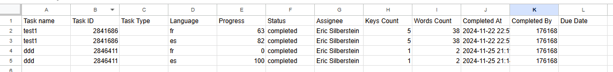
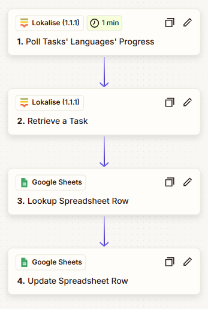

## Google Sheet Task Languages Dashboard

### Workflow Explanation

This workflow is designed to enhance your project management by providing a centralized dashboard that tracks the progress of task languages. It automatically polls your project's tasks to gather updates related to the tasks' languages' progress. After fetching the data, it checks your Google Sheet to determine whether corresponding entries already exist. If no entries are found, it creates a new entry, ensuring that your Google Sheet accurately reflects the most recent updates without any duplication.

### Blueprint Destination for Download/Use

To implement this workflow and streamline your task languages tracking, and use the template available on Zapier: [Google Sheet Task Languages Dashboard Template](https://zapier.com/shared/7eba06a60b99b7f1bfd3241b8e561240a194bfb8).