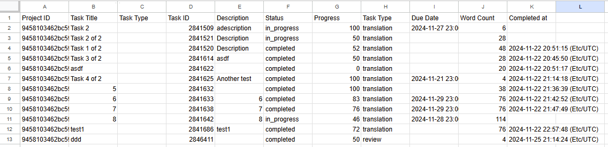
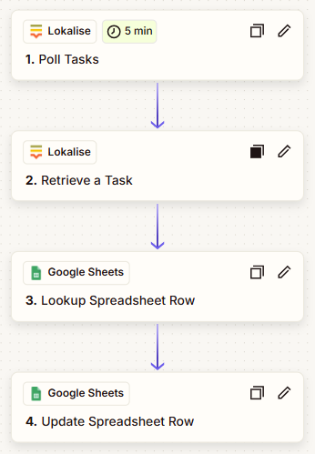

## Google Sheet Task Dashboard

### Workflow Explanation

This workflow is structured to efficiently manage task entries within Google Sheets. It continually checks for new and updated tasks within your project. When an update is detected, it promptly updates the existing entry or creates a new entry in Google Sheets, ensuring your task data remains current and accurate.

### Blueprint Destination

To implement this workflow and streamline your task tracking, use the template available on Zapier: [Google Sheet Task Dashboard Template](https://zapier.com/shared/d9479b1abd803fb09d950ec239a16e3cb0b35eab).