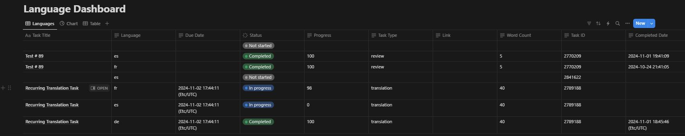

## Create a Detailed Task Dashboard for Your Lokalise Tasks in Notion

### Workflow Explanation

Keep track of the progress of all your tasks' individual languages in real-time with this workflow. It checks your projects every 5 minutes for progress updates on each task language. When a change is detected, the corresponding entry in Notion is updated, ensuring your dashboard stays current and accurate.

### Blueprint Destination for Download/Use

Streamline your task tracking with this ready-to-use Zapier template:  
[Create a Detailed Task Dashboard for Your Lokalise Tasks in Notion](https://zapier.com/shared/4c684ecabaea600b4dbc57e38ca8a36fa08d0b2f)
